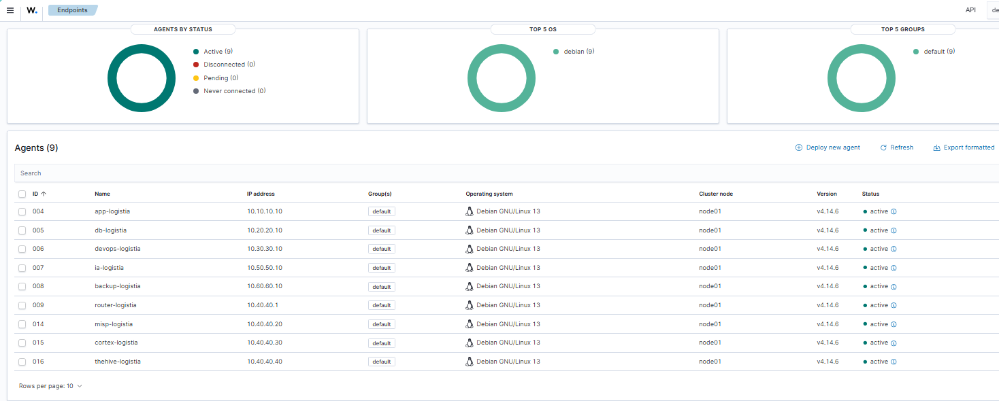
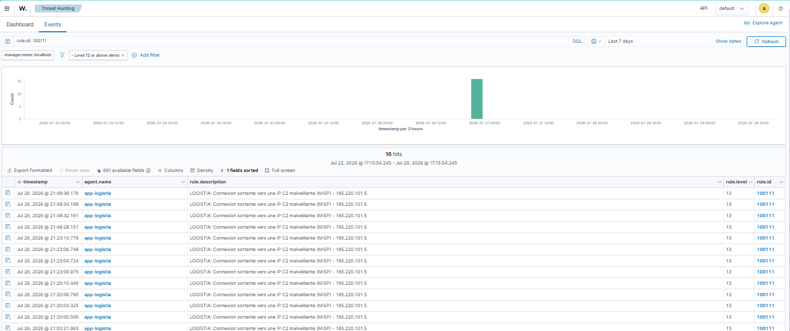
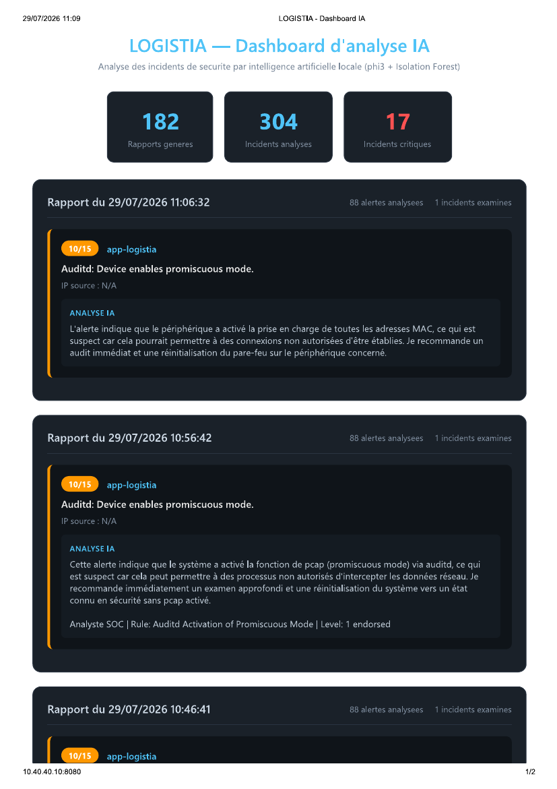

# Tests de détection et validation

Ce document rassemble les **tests de détection** menés sur l'infrastructure LOGISTIA et leurs résultats. Il apporte la preuve concrète que la chaîne de sécurité fonctionne de bout en bout : collecte des journaux, détection des menaces, réponse automatisée et investigation.

Pour le fonctionnement détaillé de la chaîne, voir [`SOC-SOAR.md`](SOC-SOAR.md).

## 1. Synthèse des tests

| # | Test | Résultat |
|---|------|----------|
| 1 | Collecte des journaux (agents Wazuh) | ✅ Validé |
| 2 | Détection de force brute SSH | ✅ Validé |
| 3 | Détection de communication vers une IP malveillante (C2) | ✅ Validé |
| 4 | Réponse automatisée (blocage de l'attaquant) | ✅ Validé |
| 5 | Analyse et explication par l'IA | ✅ Validé |
| 6 | Cloisonnement réseau (segmentation) | ✅ Validé |

## 2. Collecte des journaux — les agents Wazuh

Un agent est installé sur chaque machine et remonte ses journaux au SIEM. Neuf agents sont actifs, plus le serveur Wazuh lui-même.



*Les neuf agents connectés dans le tableau de bord Wazuh (menu Endpoints).*

## 3. Détection de communication malveillante (C2)

La règle de détection **100111** compare l'adresse de destination des connexions sortantes à la liste des adresses malveillantes synchronisée depuis MISP. Lorsqu'une machine tente de contacter une adresse répertoriée, une alerte de gravité élevée (niveau 13) est générée, associée aux techniques MITRE ATT&CK T1071 et T1571.



*Détections de connexion sortante vers une adresse de commande et contrôle (C2) référencée dans MISP. Chaque événement est enregistré avec son horodatage, la machine concernée et le niveau de gravité.*

Le fait que la même adresse soit détectée de façon répétée démontre la **fiabilité** du dispositif : à chaque tentative de communication vers une adresse listée, la détection se déclenche.

## 4. Réponse automatisée (SOAR)

Face à une **force brute SSH** (règle 100101, technique MITRE T1110), le mécanisme d'*Active Response* de Wazuh bloque automatiquement l'adresse de l'attaquant au niveau du pare-feu, en quelques secondes et sans intervention humaine.

```text
firewall-drop: Starting
  command       : add
  rule.id       : 100101
  description   : Force brute SSH detectee depuis 203.0.113.66
  rule.level    : 10
  mitre         : T1110 (Brute Force)
  agent         : app-logistia (10.10.10.10)
  srcip         : 203.0.113.66   ->   action : firewall-drop
firewall-drop: Ended

# 10 minutes plus tard : deblocage automatique
  command       : delete   (timeout 600s expire)
```

Le blocage est **temporaire** (600 secondes) : il neutralise l'attaque sans bannir définitivement une adresse, ce qui évite les blocages permanents en cas de fausse alerte. Si l'attaque persiste, la règle se redéclenche.

## 5. Analyse et explication par l'IA

Le module d'IA lit les alertes réelles produites par le SOC, sélectionne les plus importantes, et produit pour chacune une explication en français avec une recommandation d'action. Le modèle (phi3) s'exécute **entièrement en local**, aucune donnée ne sort de l'infrastructure.



*Le tableau de bord de l'IA affiche les rapports d'analyse : pour chaque incident, une explication claire et une recommandation.*

## 6. Cloisonnement réseau

Le pare-feu applique une politique « tout est interdit sauf autorisation explicite ». Ce test vérifie que, depuis le serveur applicatif, seul le flux métier autorisé atteint la base de données :

```bash
$ nc -zv 10.20.20.10 22       # port non autorise
SSH 22 vers db : BLOQUE (segmentation active)

$ nc -zv 10.20.20.10 3306     # port metier autorise
MySQL 3306 vers db : OUVERT (flux metier autorise)
```

La connexion SSH est bloquée, tandis que la requête base de données passe : **seul le flux nécessaire circule** entre les zones.

## 7. Méthodologie

Les tests de détection sont réalisés en générant des événements contrôlés (tentatives de connexion invalides, communication vers une adresse de test référencée comme malveillante) afin de vérifier que la chaîne de détection, de réponse et d'investigation réagit comme prévu. Ces tests permettent de valider le bon fonctionnement du dispositif sans impact sur l'exploitation.
