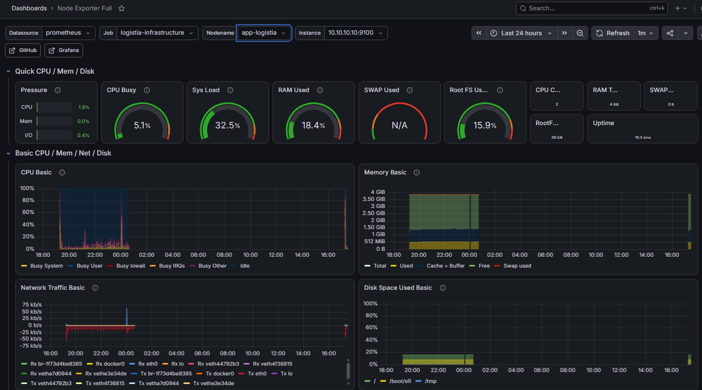
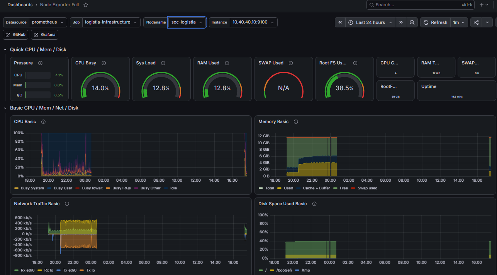

# Supervision — Prometheus & Grafana

Ce dossier présente la **supervision de l'état de l'infrastructure** LOGISTIA : la mesure en temps réel de la santé des dix machines virtuelles (processeur, mémoire, disque, réseau) et sa restitution sous forme de tableaux de bord.

La supervision est complémentaire de la détection de sécurité (voir [`tests-detection/`](../tests-detection/)) : là où le SOC surveille les **menaces**, la supervision surveille le **bon fonctionnement** des machines.

## 1. Les composants

| Composant | Machine | Rôle |
|-----------|---------|------|
| **Prometheus** | soc-logistia | Collecte en continu les métriques de toutes les machines |
| **Node Exporter** | toutes les VM | Expose les métriques système de chaque machine (CPU, RAM, disque) |
| **Grafana** | soc-logistia | Restitue les métriques sous forme de tableaux de bord visuels |

Prometheus interroge régulièrement chaque machine (via Node Exporter) et conserve l'historique des mesures. Grafana lit ces données et les affiche.

## 2. Les cibles supervisées

Neuf cibles remontent leurs métriques à Prometheus, en plus du serveur SOC lui-même. On vérifie que toutes sont actives (`health: up`) :

```bash
$ curl -s localhost:9090/api/v1/targets | grep -c '"health":"up"'
9
```

Chaque machine de l'infrastructure est ainsi suivie : serveur applicatif, base de données, DevOps, SOC, IA, sauvegarde et les briques de renseignement (MISP, Cortex, TheHive).

## 3. Les tableaux de bord Grafana

Le tableau de bord **Node Exporter Full** offre une vue complète par machine : on sélectionne la machine à surveiller, et l'on visualise sa charge processeur, sa consommation mémoire, son espace disque et son trafic réseau, sur la période souhaitée.

### Serveur applicatif (app-logistia)



*Vue Node Exporter du serveur applicatif : charge CPU, mémoire utilisée, trafic réseau et espace disque.*

### Centre de sécurité (soc-logistia)



*Vue Node Exporter du centre de sécurité. Cette machine, la plus sollicitée, héberge Wazuh, Prometheus, Grafana et le module d'IA : sa consommation mémoire est logiquement la plus élevée.*

## 4. Intérêt pour l'exploitation

Cette supervision permet de :

- **détecter une anomalie de fonctionnement** avant qu'elle ne devienne un incident (disque qui se remplit, mémoire saturée) ;
- **dimensionner l'infrastructure** en observant la charge réelle de chaque machine ;
- **corréler** un pic de charge avec un événement de sécurité (une attaque peut se traduire par une hausse d'activité).

Elle est déployée automatiquement par le rôle Ansible `logistia-soc`, comme le reste de l'infrastructure.
